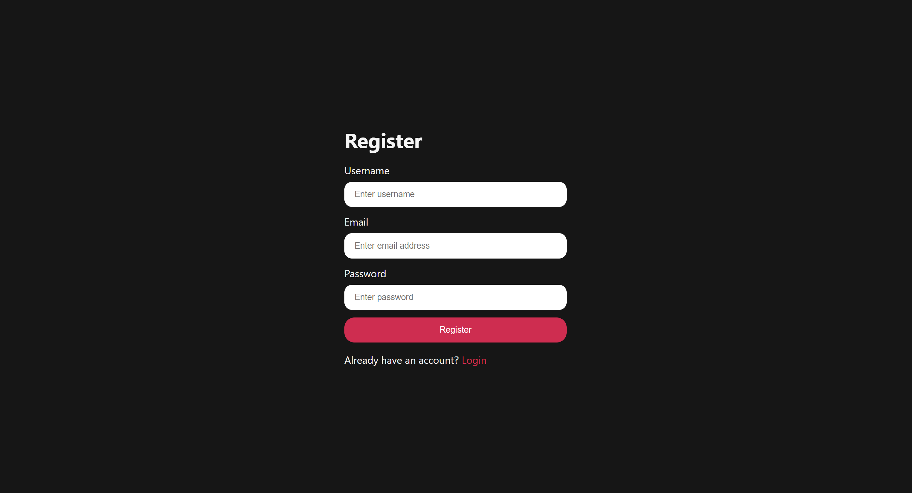
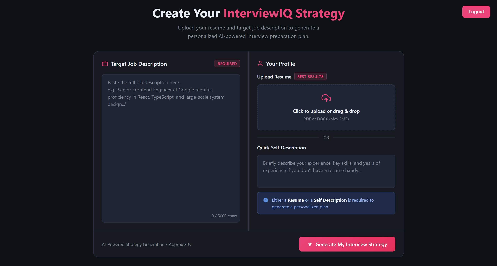
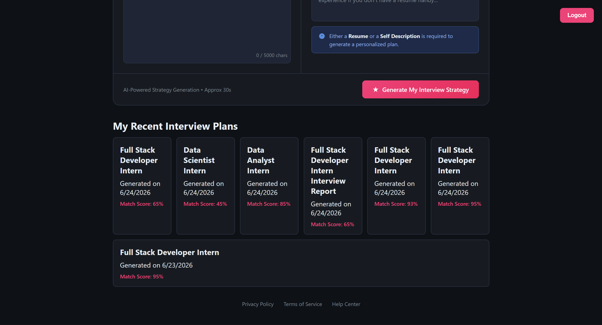
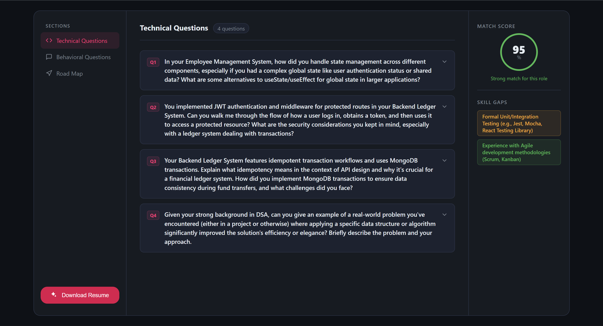

# 🚀 InterviewIQ

An AI-powered interview preparation platform that helps candidates prepare smarter by analyzing their resume and target job description to generate personalized interview strategies, technical questions, behavioral questions, skill gap analysis, and preparation roadmaps.

---

## 🌟 Features

### 🔐 Authentication

* User Registration
* User Login
* JWT-Based Authentication
* Secure Logout

### 📄 Resume Analysis

* Upload Resume (PDF)
* Resume Parsing
* Resume Profile Analysis
* Optional Self Description Support

### 🤖 AI Interview Preparation

* AI-Generated Technical Questions
* AI-Generated Behavioral Questions
* Match Score Calculation
* Skill Gap Detection
* Personalized Preparation Plan

### 📚 Interview History

* View Previously Generated Reports
* Access Reports Anytime
* Match Score Tracking

### 📥 Resume Builder

* ATS-Friendly Resume Generation
* Download Resume as PDF

---

## 🛠️ Tech Stack

### Frontend

* React.js
* React Router
* Axios
* SCSS
* Vite

### Backend

* Node.js
* Express.js
* MongoDB
* JWT Authentication
* Multer
* Puppeteer

### AI

* Google Gemini API

---

## 🌐 Live Demo

### Frontend

https://interview-iq-lac.vercel.app

### Backend

https://interviewiq-backend-dmz0.onrender.com/

---

## 📸 Screenshots

### User Registration



---

### Interview Strategy Generator

Upload your resume and job description to generate a personalized interview preparation strategy.



---

### Interview History

Access all your previously generated interview reports with their match scores.



---

### AI Generated Interview Report

Technical questions, behavioral questions, match score analysis, skill gaps, and preparation roadmap.



---

## ⚙️ Installation

### Clone Repository

```bash
git clone https://github.com/kapilyadav008/InterviewIQ.git
cd InterviewIQ
```

---

## Backend Setup

```bash
cd Backend
npm install
```

Create a `.env` file inside the Backend directory:

```env
PORT=3000

MONGO_URI=your_mongodb_connection_string

JWT_SECRET=your_jwt_secret

GOOGLE_GENAI_API_KEY=your_gemini_api_key

CLIENT_URL=http://localhost:5173
```

Run Backend:

```bash
npm run dev
```

---

## Frontend Setup

```bash
cd Frontend
npm install
npm run dev
```

---

## 💡 How It Works

1. Register/Login
2. Upload Resume (Optional)
3. Add Self Description (Optional)
4. Paste Target Job Description
5. AI Analyzes Candidate Profile
6. Generates:

   * Match Score
   * Technical Questions
   * Behavioral Questions
   * Skill Gaps
   * Preparation Roadmap
7. Download ATS-Friendly Resume PDF

---

## 📂 Project Structure

```text
INTERVIEWIQ
│
├── Backend
│   ├── src
│   ├── server.js
│   └── package.json
│
├── Frontend
│   ├── public
│   ├── src
│   └── package.json
│
├── screenshots
│   ├── register-page.png
│   ├── home-page.png
│   ├── history-page.png
│   └── report-page.png
│
└── README.md
```

---

## 🔑 Environment Variables

### Backend

Required environment variables:

```env
PORT
MONGO_URI
JWT_SECRET
GOOGLE_GENAI_API_KEY
CLIENT_URL
```

---

## 🎯 Future Improvements

* Mock Interview Chatbot
* Voice-Based Interviews
* AI Feedback on Answers
* Interview Analytics Dashboard
* Resume Version History
* Dark / Light Theme Toggle
* Company-Specific Interview Preparation

---

## 👨‍💻 Author

### Kapil Kumar

B.Tech CSE (AI & ML) | Aspiring Full Stack Web Developer

### Connect With Me

LinkedIn:
https://www.linkedin.com/in/kapil-kumar-746854339/

GitHub:
https://github.com/kapilyadav008

---

⭐ If you found this project useful, consider giving it a star.
